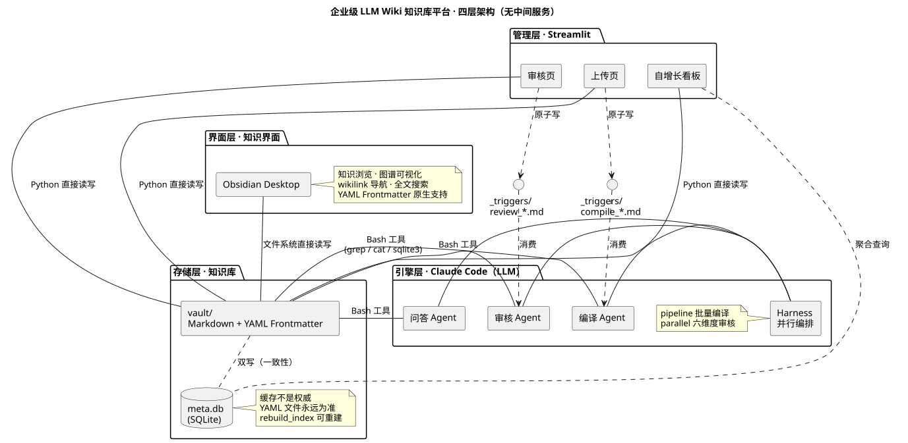
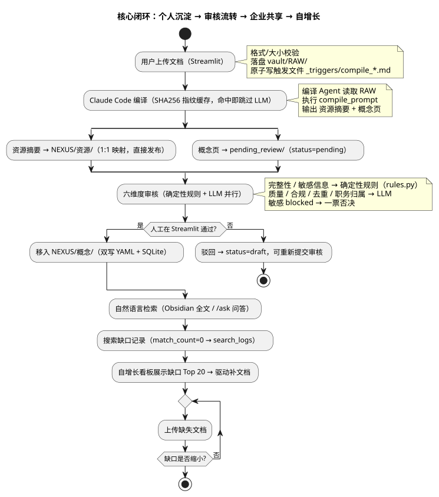

# 企业级 LLM Wiki 知识库平台

> **个人沉淀 → 审核流转 → 企业共享** — 基于 LLM Wiki 编译范式 + Google OKF 规范的企业知识流转系统。
> 入库时把原始文档编译为结构化 Markdown，替代传统 RAG"每次查询重新检索"。

[]()
[]()
[]()

---

## 为什么不是又一个 RAG 知识库？

传统 RAG 是**解释器模式**：查询时才理解文档，每次重复检索、产物是不可读的向量 chunk、知识难以流转。

本项目采用 Karpathy 提出的 **LLM Wiki 编译范式**（**编译器模式**）：在**入库时**由 LLM 把原始文档编译为**结构化、可链接、可持续演进**的 Markdown 知识条目，查询时直接读编译产物，并对齐 Google **OKF v0.1** 规范（Just Markdown + YAML Frontmatter + Reserved Files）。

> 不是"不需要 RAG"，而是范式升级——**Compile-time + Run-time RAG**（编译时理解 + 运行时检索生成）。检索物从向量 chunk 变成人类可读、可追溯的结构化知识。

**核心闭环**：`上传文档 → AI 编译 → 审核流转 → 自然语言检索 → 搜索缺口反馈 → 驱动补文档`（自增长）。

---

## 核心架构（四层，无中间服务）



**三个关键设计决策**：

1. **无后端服务** — 不引入 FastAPI/MCP Server。Claude Code 通过 Bash 工具（grep/cat/sqlite3/重定向）直接操作 Vault；Streamlit 直接读写文件与 SQLite。少一层进程 = 少一层部署/调试/维护成本。
2. **SQLite 是缓存，不是权威** — YAML Frontmatter 是规范数据源；任何状态变更双写；不一致时以文件为准；`rebuild_index()` 可从文件全量重建缓存。
3. **触发文件消息队列** — Streamlit 写 `vault/_triggers/compile_*.md`（原子写 tmp+mv）作为异步信号；Claude Code 经 SessionStart hook / `/process-triggers` 消费，实现"管理台 ↔ LLM 引擎"解耦。

### 程序与模型的分工

同一审核流程内，**规则明确的部分交给程序、拿不准的部分交给模型**：

| 维度 | 实现 | 可靠性 |
|------|------|--------|
| 完整性 / 敏感信息 | 确定性规则（`rules.py` 正则 + 测试锁边界） | 100% 可断言 |
| 质量 / 合规 / 去重 / 职务归属 | LLM 六维度评分 | prompt 约束 + 人工复核兜底 |

---

## 快速开始（clone 后即可运行）

自愈设计：应用启动时自动建表建目录，**无需预置数据库**。

```bash
git clone git@github.com:whchim/LLM_wiki.git && cd LLM_wiki

# 方式 A：Docker（推荐）
docker compose up -d          # 启动 Streamlit 管理台
# 打开 http://localhost:8501

# 方式 B：本地 Python（可选）
bash init.sh                  # 初始化 Vault 目录树 + SQLite 建表（幂等）
pip install -r requirements.txt
streamlit run streamlit_app/app.py
```

**知识浏览**：用 [Obsidian](https://obsidian.md/) 打开 `vault/` 目录，即可看到编译产物的图谱、wikilink 导航、反向链接。

> clone 后知识索引初始为空（meta.db 不入库）。沿下方"核心闭环"走一遍上传→编译→审核流程，知识库即开始增长；索引当前规模见"真实数据验收"节。

**LLM 引擎**：在项目根目录运行 Claude Code，键入 `/process-triggers` 处理上传队列、`/ask <问题>` 检索问答。

> 非 CI 环境跑测试：`python -m pytest tests -q`（37 用例）。

---

## 核心闭环（个人沉淀 → 审核流转 → 企业共享 → 自增长）



---

## 真实数据验收（2026-08）

用 **5 份真实产品文档**（示例企业"示例监测产品"应急监测系列）完成端到端走查：

| 步骤 | 结果 |
|------|------|
| AI 编译 | 5 份文档 → **5 篇资源摘要 + 21 个概念页** |
| 审核流转 | 确定性规则（完整性/敏感信息）+ LLM 六维度 → 21/21 approved |
| 人工放行 | 全部移入 `NEXUS/概念/`，文件/YAML/SQLite/index.md 四态一致 |
| 知识检索 | 跨文档概念自动互链（如"叫应体系""广播叫应"），Obsidian 图谱可见 |

**全库当前规模**：23 概念页 + 6 资源摘要。代表概念：`示例监测产品`、`塔式/杆式/空基式/便携式示例监测产品`、`云-空-塔-杆-人立体监测体系`、`广播叫应`、`边缘智算分析引擎`、`多模态加密通信`。

---

## 工程实践（文档驱动 + SDD/TDD）

这不是"代码写完了补文档"——需求、设计、实施三件套先行：

| 文档 | 内容 |
|------|------|
| [`LLM_wiki_PRD.md`](LLM_wiki_PRD.md) | 需求唯一来源 v1.7：4 类角色 / 6 大模块 / 迭代路线图 / 错误 UX 文案 |
| [`LLM_wiki_设计文档.md`](LLM_wiki_设计文档.md) | 可直接编码的详细设计 v0.1：目录结构 / SQLite DDL / 函数签名 / Agent 输入输出契约 / 触发机制 |
| [`LLM_wiki_实施计划.md`](LLM_wiki_实施计划.md) | 15 个实施 task，逐个 diff 评审 + 回归测试 |

- **发现并修正 3 处 PRD 内部不一致**（架构层数、MCP Server 取舍、编译触发机制）
- **开发范式收敛**：SDD（编译产物/检索，输入输出可形式化）+ TDD（审核确定性规则/数据层）；LLM 输出非确定部分明确不做 BDD
- **37 个 pytest 用例**：DDL 幂等、双写一致性、审核规则边界（中文紧邻漏报/金额阈值）、上传批处理补偿、驳回重提流程、索引重建鲁棒性、启动自愈

---

## 目录结构

```
├── streamlit_app/          # 管理台（app/upload/review/growth + db/ops/rules）
├── vault/                  # Obsidian 知识库根目录（Markdown + meta.db）
│   ├── RAW/                # 原始文档（个人_notes/会议/经验/项目）
│   ├── pending_review/     # 待审核概念页（Demo 精简）
│   ├── NEXUS/              # 编译产物（资源摘要/概念页/研究 + index/log）
│   └── _triggers/          # 触发文件消息队列（Claude Code 消费）
├── workflows/              # 3 个 Agent 编排（compile/review/growth）
├── prompts/                # 3 个 Agent 系统提示词
├── .claude/                # SessionStart hook + /process-triggers、/ask 命令
├── schema.sql              # SQLite 建表脚本（幂等）
├── init.sh                 # 幂等初始化（目录树 + 建表 + SCHEMA.md）
└── tests/                  # 37 个 pytest 用例
```

---

## 演进路线（规划）

- **近期**：增量编译（file watcher 只编译变更文件）、健康巡检（孤立节点/断链检测）
- **Phase 2**：向量语义检索（ChromaDB，>1000 条时替代 grep）、JWT 认证与多用户、PostgreSQL 迁移
- **Phase 3**：知识图谱（实体/关系抽取）、多租户 RBAC、外部源感知、分布式编译

---

## 相关资源

- [Karpathy · LLM Wiki Gist](https://gist.github.com/karpathy/90f50cd5cbf126f36bde3a39d67d2431) — LLM Wiki 编译范式原始理念
- **Google OKF（Open Knowledge Format）v0.1** — 知识文件标准化规范（Just Markdown + YAML Frontmatter + Reserved Files + 容错消费），本项目严格对齐
