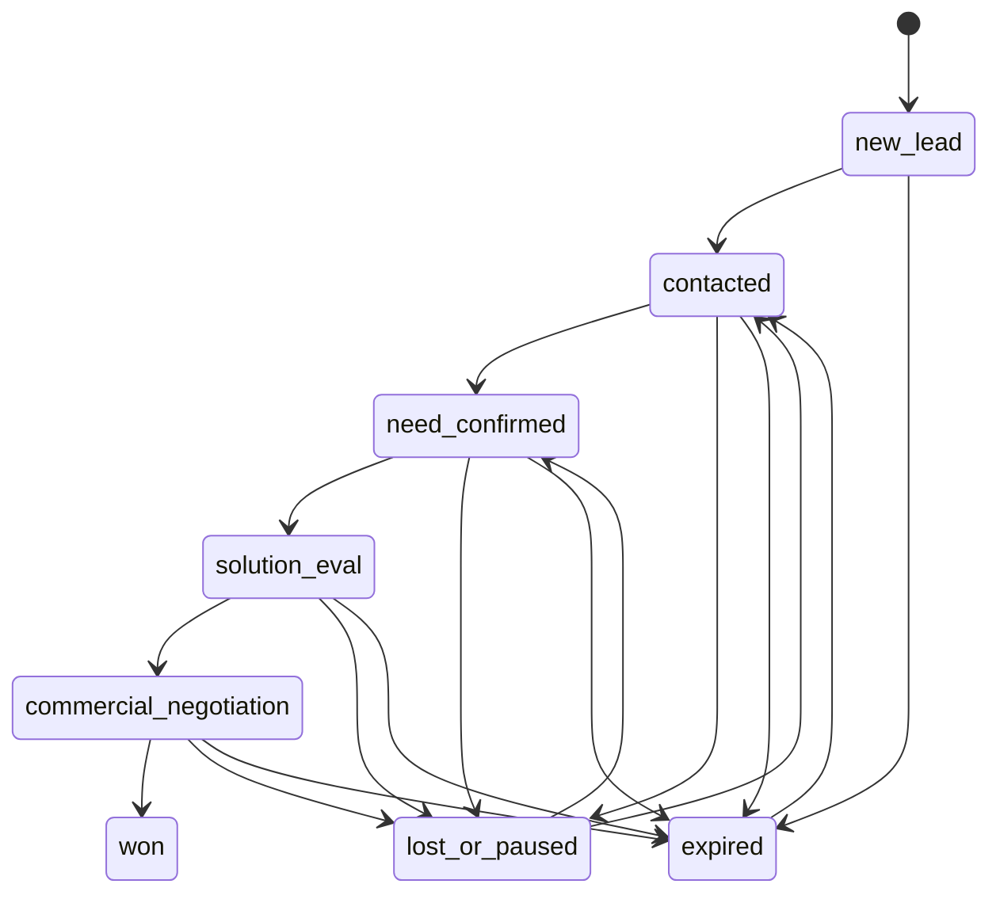

# 销售客户状态 Agent 业务契约

> 状态：阶段 0 已确认，阶段 1 设计依据  
> 版本：v0.1  
> 日期：2026-09-08  
> 适用范围：第一版生产形态 Agent 原型，不代表真实企业生产系统已经上线。

## 1. 一句话定义

系统接收一条销售洽谈后的文字记录，提取可定位的业务证据，提出有限集合内的客户状态变更建议；负责人确认后，系统才更新当前客户状态，并保留原始记录、判断依据、确认人、有效期和后续更正历史。

## 2. 第一版边界

### 2.1 纳入范围

第一版只处理**销售人员提交的中文文字洽谈记录**，来源可以是：

- 销售会后手工填写的纪要；
- 录音转写后的文字；
- 聊天记录整理后的文字。

无论来源如何，系统都把它们视为“销售提交的文字证据”，不假设文字一定客观或完整。

每条输入必须包含：

- `customer_id`：脱敏后的稳定客户标识；
- `content`：洽谈原文或整理文本；
- `occurred_at`：洽谈发生时间；
- `submitted_by`：提交人；
- `source_type`：`meeting_note` / `transcript` / `chat_summary`；
- `source_ref`：来源引用或文件指纹，可为空但必须说明原因。

如正文包含金额、预算、折扣、报价或数量等敏感数值，预处理阶段应生成稳定引用，并在供 Agent、检索和普通用户使用的文本中替换为占位符。精确值是否保留在不可变原始存档、哪些角色可以恢复精确值，由部署策略明确规定。

### 2.2 明确不纳入范围

第一版不直接处理：

- 原始音频、图片、视频和网页抓取；
- 未经脱敏的真实客户敏感信息；
- 自动发送报价、合同、邮件或外部通知；
- AI 自动确认客户状态；
- AI 自动删除或覆盖历史记录；
- 用“成交/未成交”作为唯一即时判断标准。

### 2.3 敏感数值的分层存储

销售记录中的金额、预算、折扣、报价、数量等敏感数值不直接作为普通知识正文的一部分长期暴露。第一版采用“主记录占位符 + 受限数值表”的方式：

- 原始证据保留可回放版本，但对普通 Agent、检索和非授权用户使用占位符，例如 `[AMOUNT_REF:nv-001]`；
- 实际数值写入独立的 `sensitive_numeric_values` 数据表；
- 数值表至少记录引用 ID、客户/洽谈关联、字段类型、加密值或受控密文、单位、来源证据、创建时间、访问级别和审计信息；
- Agent 默认只获得区间、比较结果或脱敏摘要，不能默认读取精确金额；
- 老板或具备授权的负责人可以在审计记录下查看精确值；
- Prompt、trace、普通日志和向量索引中不得写入精确敏感数值；
- 日期、时间、公开数量等非敏感数字不强制拆分，避免破坏状态判断所需语义；
- 这属于假名化和字段级访问控制，不等同于匿名化，密钥、权限和审计仍然是安全责任的一部分。

## 3. 角色与责任

| 角色 | 允许操作 | 不承担的责任 |
|---|---|---|
| 销售提交人 | 提交、补充和更正原始洽谈记录 | 不能直接把 AI 建议写成确认事实 |
| Agent | 提取证据、提出状态建议、标记不确定性 | 不得确认状态、删除证据、越过权限执行外部动作 |
| 销售负责人/老板 | 确认、修改、驳回、撤回状态建议 | 不应修改原始证据本身，只能提交更正说明 |
| 系统管理员 | 管理配置、权限、审计和运行状态 | 不替代业务负责人确认业务事实 |

**最终事实的责任人**：销售负责人或老板。Agent 的结果始终是建议，除非经过负责人确认，否则不能进入“当前确认状态”。

## 4. 客户状态集合（候选版本）

第一版使用有限状态集合，避免把开放世界的销售进展伪装成精确事实。

| 状态 | 含义 | 最低证据要求 | 默认有效期 | 是否必须人工确认 |
|---|---|---|---:|---|
| `new_lead` 新线索 | 已识别潜在客户，但尚未完成有效沟通 | 客户身份或线索来源明确 | 30 天 | 是 |
| `contacted` 已接触 | 已发生有效接触，但需求尚未确认 | 至少有接触时间和沟通对象 | 30 天 | 是 |
| `need_confirmed` 需求确认 | 客户明确表达了需求或问题范围 | 原文中存在客户需求的可定位引用 | 30 天 | 是 |
| `solution_eval` 方案评估 | 客户正在评估方案、技术或预算 | 原文中存在评估事项和客户动作 | 45 天 | 是 |
| `commercial_negotiation` 商务谈判 | 已进入报价、商务条件或合同讨论 | 原文中存在商务议题或客户明确反馈 | 30 天 | 是 |
| `won` 已成交 | 已有可核验的成交事实 | 合同/订单/负责人明确确认的成交证据 | 不自动过期 | 是，且需强证据 |
| `lost_or_paused` 暂停/丢失 | 当前没有继续推进，或客户明确拒绝/暂停 | 原文中存在拒绝、暂停或负责人说明 | 90 天 | 是 |

### 4.1 状态语义约束

- 状态描述的是**当前可确认的业务阶段**，不是模型对成交概率的预测。
- 没有足够证据时，Agent 必须输出 `needs_review`，不能猜测状态。
- `won` 不允许仅凭“感觉不错”“客户认可”等模糊表达成立。
- `lost_or_paused` 允许后续重新进入 `contacted` 或 `need_confirmed`，不能视为永久终态。
- 同一次洽谈中出现相互冲突的信息时，进入人工确认，不自动选择一方。

## 5. 状态机



其中 `expired` 是状态有效期结束后的**系统事件/当前视图状态**，不是删除历史记录。负责人可以基于新证据重新确认一个有效业务状态。

## 6. 业务闭环与人工门禁

```text
提交销售文字记录
  → 保存原始证据（不可变）
  → 确定性预检查
  → Agent 提取证据并提出状态建议
  → 输出契约校验
  → 风险/置信度分流
  → 负责人确认、修改或驳回
  → 写入确认状态事件
  → 更新当前状态视图
  → 到期提醒 / 新证据更新 / 撤回更正
```

以下情况禁止自动进入当前确认状态：

- 客户身份、发生时间或原文缺失；
- 状态不在枚举集合内；
- 证据引用无法定位到原文；
- `won` 缺少合同、订单或负责人确认等强证据；
- Agent 置信度低于阈值；
- 同一记录存在互相冲突的状态信号；
- 输入包含疑似 Prompt injection、越权指令或未脱敏敏感信息；
- 记录已经处理过且幂等键一致；
- 建议会跳过未允许的状态转移。

## 7. 输入契约

```json
{
  "idempotency_key": "conversation-20260908-0001",
  "customer_id": "customer-demo-001",
  "content": "客户确认正在评估方案，预计下周给出预算反馈。",
  "occurred_at": "2026-09-08T10:30:00+08:00",
  "submitted_by": "sales_demo",
  "source_type": "meeting_note",
  "source_ref": "sha256:example",
  "language": "zh-CN"
}
```

输入校验要求（阶段 3 已固化）：

- `content` 非空，长度为 10 至 12,000 个字符，且第一版必须包含中文；
- `occurred_at` 必须带时区，且不得晚于当前时间 15 分钟以上，异常时间进入人工处理；
- `customer_id` 不得使用明文手机号、身份证号等敏感标识；
- `idempotency_key` 必须稳定，重复提交不得重复产生状态事件；
- 原始输入保存后不可被 Agent 或负责人覆盖。

阶段 3 预处理还会在调用 Agent 前检测明显 Prompt injection/越权指令；命中时记录风险并隔离，不进入 Agent。金额、预算、折扣、报价和数量必须先由受控加密器生成密文，再以稳定引用和比较区间提供给 Agent。

涉及敏感数值时，Agent 输入使用引用或派生信息，不直接传递精确值：

```json
{
  "numeric_refs": [
    {"ref_id": "nv-001", "field": "budget", "summary": "预算高于方案报价", "range": "redacted"}
  ]
}
```

## 8. Agent 输出契约（阶段 4 已固化）

```json
{
  "customer_id": "customer-demo-001",
  "current_state": "need_confirmed",
  "proposed_state": "solution_eval",
  "decision": "propose",
  "confidence": 0.86,
  "evidence": [
    {
      "quote": "客户确认正在评估方案",
      "start": 0,
      "end": 13,
      "meaning": "客户已进入方案评估"
    }
  ],
  "reasoning_summary": "客户明确表示正在评估方案，但尚无成交证据。",
  "next_action": "在下周预算反馈节点前跟进客户",
  "valid_until": "2026-10-23T23:59:59+08:00",
  "needs_human_confirmation": true,
  "risk_flags": [],
  "model_version": "demo-model",
  "prompt_version": "sales-state-v0.1"
}
```

字段约束：

- `decision` 只能为 `propose`、`needs_review`、`reject`；
- `proposed_state` 只能来自状态集合；
- `confidence` 为 0 至 1，仅用于分流，不等同于事实概率；
- 每个状态建议至少有一条可定位证据，证据必须来自原始输入；
- `reasoning_summary` 只做简短可审计摘要，不保存隐藏思维链；
- Agent 不输出“已确认”状态，不直接调用状态写入工具；
- `won` 必须自动标记 `needs_human_confirmation=true` 和高风险复核；
- 输出契约不通过时，不得创建确认状态事件。

阶段 4 还要求：输出只能是 JSON 对象，不得携带未声明字段；证据的 `start/end` 必须精确对应脱敏正文；`current_state` 必须与数据库当前投影一致；非法状态转移、低置信度未标风险、`won` 未要求人工确认、缺少模型/Prompt 版本时，输出在写入建议前即被拒绝。

## 9. 过期、撤回与更正

### 9.1 过期

过期表示当前状态超过 `valid_until` 且没有新的负责人确认事件。系统应：

- 将当前视图标记为 `expired`；
- 保留原状态、证据、确认人和历史；
- 生成待跟进提醒；
- 不把过期解释为客户丢失；
- 新洽谈记录可以重新触发状态建议。

### 9.2 撤回

撤回用于处理错误确认、证据失效或业务负责人明确否定之前的状态。撤回必须：

- 创建新的 `withdrawn` 事件；
- 记录撤回人、撤回时间、原因和关联状态事件；
- 不删除原始证据和历史状态；
- 重新计算当前视图；
- 必要时进入负责人再次确认。

## 10. 风险边界

| 风险 | 第一版控制措施 | 失败处理 |
|---|---|---|
| 销售主观描述不准确 | 原文保留、证据引用、负责人确认 | 标记不确定，不自动更新 |
| Agent 幻觉 | 证据必须来自输入、结构化校验 | 输出拒绝，进入人工处理 |
| Prompt injection | 输入预检查；原文与系统指令分离 | 隔离记录并告警 |
| 客户身份混淆 | 稳定脱敏 `customer_id`、人工合并 | 禁止写入当前状态 |
| 状态跳跃 | 状态机校验 | 返回冲突，不写事件 |
| 重复提交 | 幂等键 | 返回已有处理结果 |
| 状态过期误判 | 有效期和当前时间可追溯 | 标记 expired，不删除 |
| 错误确认 | 撤回事件和负责人权限 | 保留历史并重算当前视图 |
| 敏感信息泄露 | 脱敏检查、最小权限、审计 | 阻断入库并告警 |
| 敏感数值扩散 | 独立数值表、占位符、精确值最小权限、禁止进入日志/向量 | 只保留区间或比较结果，精确值访问告警 |
| Token 成本失控 | 先规则预检；按风险选择模型；失败有限重试 | 降级到人工处理 |
| 工具越权 | 第一版 Agent 不直接执行外部写操作 | 仅生成建议 |

## 11. 验收指标

第一版只使用合成数据回放，所有结果必须标注为 synthetic evaluation。

### 11.1 功能与安全硬门槛

以下任一项不通过，阶段不算完成：

- 原始输入 100% 可回放且不可被确认流程覆盖；
- 不合规输入 100% 不产生确认状态事件；
- 非法状态转移 100% 被拒绝；
- 重复幂等请求不产生重复状态事件；
- 撤回不删除原始证据或历史事件；
- 每个确认状态都有负责人、时间、来源和证据引用；
- Agent 无法绕过人工门禁直接更新确认状态。

### 11.2 质量指标

初始目标值（后续可调整，但调整必须记录原因）：

| 指标 | 初始目标 | 说明 |
|---|---:|---|
| 状态集合合法率 | 100% | 输出状态必须在枚举内 |
| 证据可定位率 | ≥95% | 引用可在原文中定位 |
| 状态建议准确率 | ≥80% | 与合成案例标注状态一致 |
| 高风险/证据不足拦截率 | 100% | 不得静默自动确认 |
| 人工修改率 | 记录基线 | 不预设过低目标，先观察 |
| 重复事件率 | 0% | 幂等测试必须通过 |

### 11.3 成本与时延指标

先记录基线，再决定是否优化：

- 单条输入平均 Token 消耗；
- 单条输入平均处理时延；
- 规则拦截比例；
- 需要强模型二次判断的比例；
- Agent 失败重试比例；
- 每条成功状态建议的估算成本。

## 12. 待负责人确认的决策

以下内容已作为阶段 0 的确认决策，后续实现以此为约束：

1. 接受第一版只处理中文销售文字记录；
2. 接受上述 7 个候选状态，后续删改需形成新版本；
3. `won` 必须要求合同/订单或负责人确认等强证据；
4. 最终确认、修改和撤回由销售负责人或老板负责；
5. 过期后当前视图显示 `expired`；
6. 所有 AI 结果都是建议，负责人确认后才成为事实；
7. 第一版使用 30 至 50 条合成案例评测，并明确标注 synthetic；
8. 初始质量目标为：状态建议准确率 ≥80%、证据可定位率 ≥95%；
9. 敏感金额、预算、折扣、报价和数量进入独立受限表，普通 Agent 只使用占位符、区间或比较结果，精确值仅向授权负责人开放。

## 13. 阶段 0 退出标准

阶段 0 已完成。当前冻结：

- 输入范围；
- 状态集合；
- 证据要求；
- 人工门禁；
- 过期和撤回语义；
- 评测指标。
- 敏感数值的存储、脱敏和访问边界。

之后的数据库设计和代码实现不得自行扩大范围；任何变更必须形成新的版本记录。
