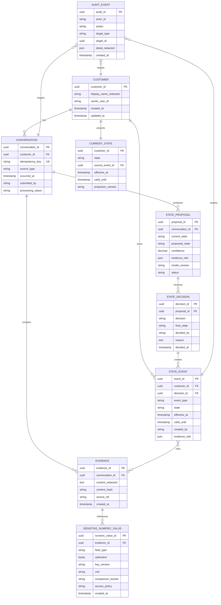
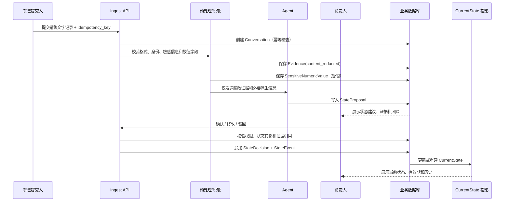

# 销售客户状态 Agent 领域模型

> 阶段：1（领域模型与知识分层）  
> 状态：阶段 1 已确认；阶段 2 数据层实现中  
> 版本：v0.1  
> 日期：2026-09-08  
> 依据：`SA-01_销售客户状态Agent_业务契约.md` 已确认的阶段 0 边界。

## 1. 建模结论

第一版的业务中心不是 `knowledge_entries` 文档，而是**客户状态生命周期**。普通知识库继续作为背景知识和检索基础，但客户当前状态必须由可追溯的确认事件产生。

模型采用三条边界：

1. **证据边界**：原始销售输入只追加、不覆盖；供 Agent 和普通查询使用的是脱敏文本。
2. **判断边界**：Agent 只能生成 `StateProposal`，不能写入确认事实。
3. **事实边界**：只有销售负责人/老板确认后，才产生 `StateEvent`，`CurrentState` 是确认事件的当前投影。

## 2. 核心对象

| 对象 | 责任 | 是否可变 | 关键关系 |
|---|---|---|---|
| `Customer` | 客户的稳定脱敏身份和基本元数据 | 受限更新 | 1:N `Conversation`，1:1 `CurrentState` |
| `Conversation` | 一次销售洽谈的业务上下文和幂等身份 | 不覆盖，允许补充元数据 | N:1 `Customer`，1:N `Evidence` |
| `Evidence` | 销售提交的文字证据及来源 | 内容不可变 | N:1 `Conversation`，可关联敏感数字引用 |
| `StateProposal` | Agent 基于证据提出的状态建议 | 只读版本 | N:1 `Conversation`，可被负责人处理 |
| `StateDecision` | 负责人对建议的确认/修改/驳回 | 追加记录 | 1:1 或 1:N `StateProposal` |
| `StateEvent` | 已确认状态变化、过期、撤回和更正事件 | 追加不可变 | N:1 `Customer`，引用证据和决定 |
| `CurrentState` | 当前有效状态的查询投影 | 可重建 | 1:1 `Customer`，指向最新 `StateEvent` |
| `SensitiveNumericValue` | 金额、预算、折扣、报价、敏感数量等精确值 | 受限更新 | 关联 `Evidence`，独立权限域 |
| `AuditEvent` | 访问、确认、撤回、恢复精确值等审计 | 追加不可变 | 关联操作者和业务对象 |

## 3. 聚合边界

### 3.1 Customer 聚合

`Customer` 是查询和状态管理的主聚合，包含：

- 稳定脱敏 `customer_id`；
- 当前状态投影 `CurrentState`；
- 状态事件引用；
- 当前负责人和更新时间。

它不直接保存销售原文，也不保存精确金额。

### 3.2 Conversation 聚合

`Conversation` 表示一次洽谈事实：

- 有稳定 `idempotency_key`；
- 关联一个客户；
- 保存发生时间、提交人、来源类型和处理状态；
- 关联一个或多个不可变 `Evidence`；
- 关联 Agent 建议和人工决定。

重复提交同一个 `idempotency_key` 必须返回原处理结果，不得创建第二个状态事件。

### 3.3 StateEvent 事件流

`StateEvent` 是事实写入的唯一入口。事件类型至少包括：

- `state_confirmed`：负责人确认状态建议或修改后的状态；
- `state_expired`：系统根据有效期标记当前视图过期；
- `state_withdrawn`：负责人撤回错误或失效的状态；
- `state_corrected`：基于新证据更正历史判断。

事件不能被更新或删除；当前状态通过合法事件重新计算。

## 4. ER 图



## 5. 知识分层

```text
L0 原始来源层
  销售提交的原始文字 / 外部来源引用
  不允许 Agent 或负责人覆盖；精确敏感数值不进入普通可读副本

L1 脱敏证据层
  content_redacted、content_hash、来源、时间、提交人
  可供 Agent 处理和普通审计回放

L2 Agent 判断层
  StateProposal：状态建议、证据引用、置信度、风险、模型版本
  永远不是最终事实

L3 业务事实层
  StateDecision + StateEvent：负责人确认后的状态、有效期、撤回和更正
  CurrentState 是该层的查询投影

L4 背景知识层
  原有 resource/concept/research/glossary
  用于产品、方案、行业等相对稳定的背景知识，不直接替代客户状态事件

L5 敏感数值层
  SensitiveNumericValue：精确金额、预算、折扣、报价、敏感数量
  独立权限、加密存储、访问审计，不进入普通正文、Prompt、trace 或 embedding
```

### 5.1 精确数值的访问规则

- 普通 Agent 读取 `content_redacted` 和 `comparison_bucket`，不读取 `ciphertext` 解密结果。
- 普通检索只索引脱敏证据和派生摘要。
- 负责人查看精确值必须经过单独权限检查，并记录 `numeric_value_viewed` 审计事件。
- 系统管理员可以维护密钥和权限，但默认不承担业务确认权限。
- 加密密钥不存放在数据库表中；`key_version` 只用于密钥轮换和解密路由。
- 若业务必须对精确数值做计算，使用受控服务返回最小必要结果，不把明文写入日志或模型上下文。

## 6. 状态事件时序



## 7. 状态不变量

1. 没有 `StateEvent`，就没有“当前确认状态”。
2. 每个 `StateEvent` 必须关联负责人、时间、来源证据和有效期语义。
3. `CurrentState.source_event_id` 必须指向最新有效事件。
4. `StateProposal` 不能直接更新 `CurrentState`。
5. 撤回和更正只追加事件，不删除历史。
6. 任何状态事件都不能修改 `Evidence.content_redacted`。
7. 精确敏感数值不能出现在 `Evidence.content_redacted`、`StateProposal`、`StateEvent`、`AuditEvent.detail_redacted` 或向量索引。
8. 重复 `idempotency_key` 不得产生新的 `StateEvent`。

## 8. 旧模型映射

| 现有对象 | 第一版新语义 | 处理方式 |
|---|---|---|
| `RAW/<category>` 文件 | `Conversation` 的来源输入 | 保留为导入适配层；新流程写入 Conversation/Evidence |
| `compile_tasks` | 输入解析/预处理任务 | 可复用任务状态思想，不作为业务事实来源 |
| `pending_review` 文件 | `StateProposal` 的兼容展示或迁移中间产物 | 新流程不把文件状态当最终客户状态 |
| `pending_reviews` | Agent 建议与人工决定 | 逐步拆为 StateProposal/StateDecision |
| `knowledge_entries` | 背景知识和旧文档索引 | 保留；增加客户状态查询，不混用 `active` 表示客户成交事实 |
| `resource` | 产品/方案等背景知识 | 保留在 L4，不直接更新 Customer 当前状态 |
| `concept` | 企业概念知识 | 保留在 L4，可作为 Agent 判断参考 |
| `audit_logs` | 通用审计底座 | 扩展 target_type/target_id 和敏感数值访问审计 |
| `trace_events` | Agent/系统运行观测 | 只记录脱敏摘要和引用，不记录精确敏感值 |
| `search_logs` | 检索行为统计 | 保留，但客户状态查询需单独权限和审计 |

## 9. 一致性和恢复原则

- 数据库是业务状态事件的权威来源；Markdown 只作为可读导出或背景知识载体。
- `CurrentState` 必须可由 `StateEvent` 全量重建。
- Agent 写入失败不得创建半成品事实事件。
- 负责人确认接口必须使用条件更新或锁，避免重复确认。
- 事件写入与投影更新必须在同一数据库事务内，或由可重放投影任务补偿。
- 敏感数值表与普通证据表使用不同访问角色；备份、导出和测试数据也必须遵守同一分层规则。

## 10. 阶段 1 退出标准

阶段 1 完成需满足：

- 领域对象、聚合边界和事件类型已明确；
- ER 图和状态事件时序可指导数据库设计；
- 原始证据、Agent 建议、人工事实和背景知识已分层；
- 敏感数值独立表、占位符、访问权限和审计边界已明确；
- 旧 `resource/concept` 模型有兼容映射，不与客户状态事实混用；
- 能从任意 `CurrentState` 追溯到负责人、证据、时间和历史事件。

## 11. 阶段 1 确认记录

负责人已确认以下内容，阶段 2 已开始实施：

1. 是否接受“StateEvent 是业务事实唯一写入口，CurrentState 是投影”；
2. 是否接受普通 Agent 和检索永不读取精确敏感数值；
3. 是否接受原始输入采用脱敏可读副本，精确值进入独立受限表，必要时另行加密存档；
4. 是否接受保留现有 `resource/concept` 作为背景知识，但不把其 `active` 状态当作客户成交事实；
5. 是否接受数据库成为客户状态事件权威来源，Markdown 只作导出/展示适配层；
6. 是否接受上述对象、ER 关系和事件类型作为阶段 2 数据层实现依据。
